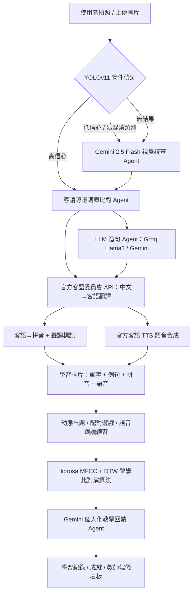

# AI 應用與 Prompt / 工具設計說明書

**作品名稱：隨拍、隨比、隨時學，AI客語隨身教**
**參賽組別：大專生組｜教育領域（AI Agent／Vibe Coding）**

---

## 一、專案動機與問題定義

台灣正值本土語言教育的關鍵轉型期：教育部「中小學數位學習精進方案」（生生用平板）已為多數國中小配發平板，將其導入日常自主學習；同時依據 108 課綱與《國家語言發展法》，國小本土語文（含客語）自 111 學年度起列為部定必修。政策面的資源與制度已經到位，但客語（尤其四縣腔）身為瀕危語言，教學現場仍面臨結構性的師資與教材缺口。

真正卡住學習者的，不是「有沒有教材」，而是**「生活語言環境差異」**：當學習者在日常生活中看到某個物品、對「這個東西的客語怎麼說」產生好奇時，往往得先開瀏覽器、打關鍵字、查客語辭典——這一連串繁瑣的查詢流程，會讓一時的好奇心在抵達答案之前就先冷卻，學習動機與連續性因此被中斷。對本來就不熟悉客語腔調差異的初學者而言，這個查詢門檻更是雪上加霜。

市面上現有的客語數位工具，多半停留在「靜態教材呈現」或「使用者手動輸入文字才能查詢」的模式，缺乏從「即時情境沉浸」出發的設計；而客語作為高度仰賴聽力、口說與生活情境連結的語言，這種去情境化的學習方式難以真正激發學習動機。

因此本作品提出**「所見即所學」**的核心理念：能不能讓學習者「拍一張照片」就開始學客語，並讓 AI 像家教一樣即時聽、即時教？我們把整個學習流程設計成一條 **多 Agent 協作的 AI 管線**：影像理解 → 詞庫比對 → 語言生成 → 機器翻譯 → 語音合成 → 語音評分 → 個人化回饋 → 遊戲化複習，每一段都由不同的 AI 服務／模型分工，並用工程手法（fallback、快取、平行化）確保在教室或戶外等網路不穩定的環境下也能穩定運作，把「看見」與「學習」之間的距離縮到最短。

---

## 二、系統架構總覽

系統採「去耦合模塊化架構」，將高互動性的前端視覺元件與後端業務邏輯深度抽離，避免前後端過度耦合，方便未來擴充新語系或新功能。整體可分為三大核心模塊，彼此透過清楚的 API 輸入輸出契約串接：

- **翻譯與辨識模塊**：負責處理影像、文字、語音輸入，並產出核心學習內容（單字、例句、拼音、語音），是驅動整個學習體驗的引擎。
- **學習與練習模塊**：把翻譯與辨識模塊產生的素材，轉化為動態出題、配對遊戲與口說練習，並將每一次練習結果寫入學習紀錄。
- **通用支援模塊**：提供相機／音訊等多媒體存取、使用者與班級權限管理、通知系統，以及 UI/UX 介面，支撐前兩個模塊穩定運作。



技術實作上，後端以 **FastAPI（Python）+ PostgreSQL（SQLAlchemy async）** 為骨幹，前端為響應式 HTML/JS 介面（手機／平板／桌機皆可用），並以 Docker／docker-compose 容器化部署。整體不是單一個「聊天機器人」，而是把 YOLO、Gemini、Groq、官方客語 API、DTW 聲學演算法等多個服務串成 **任務導向的 Agent 流程**，每個節點都有明確的輸入輸出契約與失敗後援機制，這也是三大模塊能夠獨立開發、獨立測試、又能穩定串起來的關鍵設計。

---

## 三、核心 AI 應用模組

### Prompt 設計方法論：從想法到可用 Prompt

以下每一段 Prompt 都不是一次寫成的。實際開發流程是：

1. **提出粗略想法**：先用口語化的方式描述這個情境「大概想要 AI 做什麼」，例如「請它幫我看圖片裡的東西是什麼」「請它跟學生講評語，但不要太嚴厲」這種未結構化的需求。
2. **請 AI 協助優化**：把這個粗略想法交給 AI（Claude），請它協助補上角色設定、輸出格式限制（JSON schema）、防呆規則與用詞邊界，將口語想法轉換成一份可以穩定被程式解析、不易產生幻覺的正式 Prompt。
3. **依實測結果迭代**：把優化後的 Prompt 接上真實資料測試（例如真的把眼鏡誤判成酒杯、LLM 回傳的 JSON 前後多了說明文字），再回頭把這些真實錯誤案例寫回 Prompt 裡（例如「眼鏡、太陽眼鏡、護目鏡請回傳『眼鏡』，不要回傳『酒杯』」這類規則），形成一個「想法 → AI 優化 → 實測 → 修正」的反覆迭代循環，而不是憑空一次到位。

這個方法論也是本作品在「Prompt Engineering」向度上想強調的重點：**產品的 Prompt 品質來自於人與 AI 共同反覆打磨，而非單次生成。**

#### 敘述風格範例（依作者實際下 Prompt 習慣重建，非逐字歷史紀錄）

作者向 AI 提需求時，習慣用一段口語化、需求夾雜著限制條件的敘述，把「我想要什麼」一次講完，再請 AI 幫忙整理成正式可用的 Prompt。以下用同樣的敘述風格，重建「語音評分回饋」這個模組在優化前大概的樣子，藉此示範方法論如何運作（原始逐字內容已不可考，此處為依真實風格重建的示意版本）：

> **優化前（口語想法）**：
> 「你可以幫我用 AI 寫一個東西嗎，就是我這邊有一個 DTW 分數跟診斷報告，然後我想要讓一個像客語老師的 AI 根據這個分數跟報告去跟學生講一句話，就是像老師會講的那種鼓勵的話，可是如果分數很低的話語氣不要太用力稱讚，怕學生會誤會自己講得很好，然後幫我設計出一個這樣的 prompt。」

> **AI 協助優化後（實際上線版本）**：見本文件「模組 3：語音評分＋個人化教學回饋 Agent」中的完整 Prompt，補上了角色設定（「極具親和力、溫柔且專業的台灣客家話家教老師」）、資料錨定（把分數與診斷報告當作必須依據的事實）、依分數分流的語氣指令、字數上限（30 字內），以及低分時「嚴格禁止說『很棒』『完美』『優秀』」的反面約束。

這個對照示範了整個方法論的核心：**作者提供的是「教學意圖」與「不想要什麼」的直覺判斷，AI 負責把它轉譯成 LLM 聽得懂、程式解析得穩定、又不會失真的結構化指令。**

### 模組 1：拍照物件辨識 Agent（YOLO + Gemini 混合路由）

**問題**：純本地 YOLOv11 模型速度快但類別有限（COCO 80 類）、容易誤判（例如把眼鏡誤認成酒杯）；純雲端 Gemini 準確但有延遲與配額限制。

**設計**：做一個「路由 Agent」，依信心分數與類別動態決定要不要呼叫 Gemini：

- `confidence ≥ 0.8` 且非易混淆類別 → 直接採用 YOLO 結果（省成本、省時間）。
- `confidence < 0.8` 或屬於 `GEMINI_REVIEW_CLASSES`（如 wine glass／眼鏡）→ 把該物件的**裁切局部圖**送給 Gemini 複查，而不是整張照片，避免其他物品干擾判斷。
- 偵測到人物時，額外整張圖再問一次 Gemini，補抓眼鏡、背包等 COCO 類別沒有的小型配件。
- Gemini 或 YOLO 任一方完全失敗，另一方自動 fallback，確保永遠有結果可回傳。

**Prompt 設計**（`routers/recognition.py`）：

```text
你是圖片物品辨識的複查助手。
請辨識圖片中最主要、最適合拿來學習詞彙的物品單詞，最多 5 個。
每個結果只能是單一物品名詞，不要回傳句子、形容詞、場景描述、動作或用途。
繁體中文單詞請盡量控制在 2 到 6 個中文字，例如「眼鏡」、「水壺」、「鉛筆盒」。
如果 YOLO 初步結果和圖片內容不一致，請以圖片內容為準，不要照抄 YOLO。
請特別注意：
- 眼鏡、太陽眼鏡、護目鏡請回傳「眼鏡」，不要回傳「酒杯」。
- 只有真的看到有杯腳或盛酒用的玻璃杯，才可以回傳「酒杯」。
- 如果物品不確定，請選擇較通用、較適合學習的名稱。
[此處動態插入 YOLO 初步候選作為提示]
請只回傳 JSON，不要加解釋。

格式：
{ "items": [ { "label_zh": "...", "label_en": "...",
               "confidence": 0.0, "bbox_xyxy": [x1,y1,x2,y2] } ] }
```

**Prompt Engineering 重點**：
- **角色設定**：明確定義 Gemini 的身分是「複查助手」而非「主辨識者」，並提供 YOLO 候選作為參考而非標準答案，避免模型盲目跟隨錯誤前提。
- **輸出格式鎖定**：強制 `response_mime_type: application/json` + 結構化 schema，讓後端可以穩定 parse，不用寫脆弱的正則解析。
- **域知識注入（few-shot 規則）**：針對系統實測會出錯的案例（眼鏡 vs 酒杯）直接寫進 prompt，屬於「用真實錯誤資料反覆迭代 prompt」的過程。
- **座標正規化**：要求 bbox 用 0–1000 正規化座標回傳，前後端座標系統一致，避免不同解析度圖片跑版。
- **失敗防呆**：對「眼鏡」類別另外寫了一層程式碼幾何合理性檢查（`_is_plausible_bbox_for_label`），Prompt 管不到的部分用程式規則補強——這是「AI + 傳統演算法」混合治理的典型設計。

---

### 模組 2：LLM 例句生成 Agent（Groq 優先、Gemini 備援）

**問題**：學習單字若沒有情境例句，記憶效果差；但呼叫雲端 LLM 有延遲、配額、成本考量，尤其教室內多人同時使用容易觸發 rate limit。

**設計**：採 **雙供應商容錯鏈**：優先用 Groq（`llama-3.1-8b-instant`，免費且延遲低），失敗才 fallback 到 Gemini 2.0 Flash；若兩者皆不可用（配額耗盡／無金鑰），改用**本地罐頭例句庫**，並在資料中標記 `sentence_source: local_fallback`，確保系統「絕不會因為 AI 服務中斷而整個功能掛掉」。

**Prompt 設計**（`routers/learning.py`，批次造句版）：

```text
你是一個專業的中文句子生成助手。請根據我提供的中文單字，為每個單字各造一個中文生活句子。
要求：
1. 每個句子都要是中文，長度約 10 到 20 個中文字。
2. 內容要自然、生活化、適合國小生。
3. 只輸出合法的 JSON 陣列，不要有任何額外說明。
4. 格式如下：
[
  {"word": "蘋果", "sentence_zh": "這顆蘋果看起來又紅又香。"},
  {"word": "公園", "sentence_zh": "我們在公園裡一起散步。"}
]

輸入單字：{words_str}
```

**Prompt Engineering 重點**：
- **批次化**：一次把多個單字包進同一個 prompt、一次呼叫回傳整個 JSON 陣列，大幅降低 API 呼叫次數與延遲（相較逐字呼叫可省下 4–5 倍請求數）。
- **受眾錨定**：明確指定「適合國小生」的難度與語氣，讓生成內容穩定落在教育情境，而非泛用文本。
- **長度約束**：限制字數區間，兼顧語音合成（TTS）長度與跟讀練習的可行性。
- **溫度控制**：`temperature=0.3`，在「有變化」與「不離題／不亂造詞」之間取平衡。
- **容錯 JSON 清洗**：`_clean_json_text()` 專門處理 LLM 常見的 ```json code fence 包裹問題，是實際串接 LLM API 時必踩的坑。

---

### 模組 3：語音評分 + 個人化教學回饋 Agent（DTW 演算法 × Gemini）

這是全系統中「AI Agent 感」最強的模組：**傳統訊號處理演算法產出客觀數據，再交給 LLM 轉譯成有溫度、可執行的教學語言**，而不是直接把演算法分數丟給學生。

**流程**：

1. 使用者跟讀錄音 → `librosa` 抽取 MFCC + Delta + Delta² 特徵。
2. 與官方標準音做 **DTW（Dynamic Time Warping）** 動態時間校正比對，計算距離、音量比、路徑偏移、涵蓋率等多維度指標。
3. 用 RMS 能量偵測「音節峰值」，找出使用者哪一個音節發音落差最大，產生**結構化診斷報告**（例如：「大部分發音良好，但偵測到【第 2 個音節】的音調或咬字有些許瑕疵。」）。
4. 依分數區間決定「教學語氣指令」（`tone_instruction`），再把 **分數 + 診斷報告 + 語氣指令** 一起組成 Prompt，交給 Gemini 生成最終的一句話回饋。

**Prompt 設計**（`routers/practice.py`）：

```text
你是一位極具親和力、溫柔且專業的台灣客家話家教老師。
有一位學生剛剛練習了這個客語詞彙：『{word}』。

後端聲學演算法給出的客觀評分與數據報告如下：
- 學生得分：{final_score} 分
- 演算法診斷結果：{diagnostic_report}

老師今晚的教學語氣與嚴格度指標：
{tone_instruction}

請根據以上數據與指標，用 30 個字以內、親切的口吻，給予學生一句最切合他當前分數的發音優化建議或評語。
嚴格限制：不要重複演算法專有名詞，直接切入正題。
```

其中 `tone_instruction` 會依分數動態切換，例如低分區間會特別加入：

```text
學生分數很低，代表發音有明顯進步空間。嚴格禁止說「很棒」、「完美」、「優秀」等誇獎詞！
請用溫柔、有耐心但客觀的家教口吻，直接點出問題並給予具體建議，語氣要委婉但實事求是。
```

**Prompt Engineering 重點**：
- **Grounding（事實錨定）**：LLM 不是憑空生成鼓勵語，而是**必須根據演算法給的客觀數據**作答，避免「幻覺式讚美」（例如發音明明不標準卻說很完美）——這是教育類 AI 應用最重要的可信度設計。
- **動態語氣控制**：用程式邏輯先決定「這次要用什麼教學策略」，再把策略寫成自然語言指令餵給 LLM，等於把「教學法」外顯成可調整的 prompt 參數，而不是寫死在程式或全部交給 LLM 自由發揮。
- **反面約束（negative constraint）**：低分時明確禁止特定用詞，防止 LLM 為了「友善」而失真，這點對教育情境的誠信非常關鍵。
- **輸出長度硬限制**：30 字以內，確保適合語音／卡片 UI 呈現，不會出現落落長的說教。
- **保底機制**：Gemini 呼叫失敗時直接退回演算法產生的 `diagnostic_report` 當作回饋，功能不中斷。

---

### 模組 4：OCR 關鍵詞抽取 Agent（拍書本／課文學習）

讓使用者拍下課本或標語，OCR 出文字後，用 LLM 做「品管 + 關鍵詞抽取」雙重任務：

```text
你是一位中文語言教學專家，同時也是嚴格的文字品管員。
以下是一段從圖片 OCR 辨識出的中文文字（可能含有辨識錯誤）：

「{text}」

你的任務：
1. 先判斷這段文字是否為「可讀的正常中文」。如果文字明顯是亂碼或辨識錯誤
   （例如「三注音妨礙外」這種無意義組合），請直接回傳空陣列 []。
2. 如果文字正常，從中抽出 5 到 8 個「真實存在於中文詞典的詞彙」
   （名詞、動詞、形容詞優先，長度 2~4 字，避免虛詞、標點、數字）。
3. 每個詞彙必須是完整、有意義的中文詞，不可以是隨機切割的字組合。

只回傳一個 JSON 陣列，不要有任何額外說明：
["詞彙1", "詞彙2", "詞彙3"]
```

**設計重點**：把「判斷輸入是否有效」與「抽取結果」合併在同一次呼叫中完成（第 1 步可直接回傳空陣列拒答），減少一次額外的驗證呼叫；`temperature=0` 確保同一段文字重複執行結果穩定，適合品管型任務。

---

### 模組 5：資料回饋 Agent（邊角案例自動校正，資料飛輪）

當學生回報某個客語字寫錯或發音對應錯誤時，系統不是單純存進資料庫，而是先讓 LLM 做**語言學規範性校正**，再存檔：

```text
你是一位精通台灣客語（含四縣、海陸等腔調）的語言學專家。
使用者嘗試拼寫一個客語詞彙：'{correct_text}'，這原本是要用來修正 '{wrong_text}' 的。
請判斷使用者的客語漢字或拼寫是否符合教育部台灣客語辭典的標準規範？
如果不符合，請直接幫他修正，並「只回傳修正後的客語漢字/詞彙」；
如果完全正確，請原樣回傳。
切記：不要有任何額外的解釋、引號或標點符號，只需要回傳最終的客語字。
```

**設計重點**：這是一個「AI 預審 + 人工資料集」的資料飛輪雛形——使用者的修正被 LLM 自動標準化後存成 `dataset_storage/metadata.jsonl`，未來可用於微調本地小模型（專案內建有 `qwen2.5-3b-instruct-q4_k_m.gguf` 作為離線 LLM 備援），呼應教育情境中「資料越用越準」的長期產品思維。

---

## 四、多 Agent 容錯與成本控制策略（工程設計，非單純 Prompt）

| 策略 | 說明 |
|---|---|
| **信心分流路由** | 只有低信心／易混淆結果才呼叫昂貴的視覺 LLM，高信心直接用本地 YOLO，節省 API 成本與延遲 |
| **多供應商鏈式備援** | Groq → Gemini → 本地罐頭句／本地 GGUF 模型，三層防護避免單一供應商配額或故障癱瘓全站 |
| **429/503 智慧重試** | 只對「暫時性錯誤」（rate limit、服務不可用）做指數退避重試，其餘錯誤直接放棄轉 fallback，避免無謂等待 |
| **全域退避窗口** | Gemini 429 時設定 60 秒全域冷卻，避免短時間內大量重複打到同一個被限流的端點 |
| **翻譯結果快取（LRU）** | 官方客語翻譯 API 呼叫有限額，用 `OrderedDict` 做 2048 筆 LRU 快取，重複詞彙不重複打 API |
| **語音檔內容雜湊快取** | TTS 以「引擎+語言+音色+語速+文字」做 SHA-256 快取鍵，相同內容永遠重用同一份語音檔，大幅降低語音合成延遲與費用 |
| **裁切局部圖再送審** | 送給 Gemini 複查時只送物件裁切圖而非整張照片，提升判斷準確率並減少 token／頻寬用量 |
| **平行化管線** | 翻譯、拼音、造句、TTS 等多個 I/O bound 任務用 `asyncio.gather` 全部平行執行，並用 `Semaphore` 限制 TTS 同時併發數（3），在「速度」與「不觸發限流」間取得平衡 |

---

## 五、AI 開發工具鏈（Vibe Coding 實踐紀錄）

本作品的開發流程即是「用 AI 輔助 AI 產品開發」的實例：

- **Claude Code**：作為主要協作開發環境，以自然語言描述需求（例如「改善遊戲回饋與練習範圍」「加入語音分析進度提示」「加入平板與桌面響應式版面」），由 AI 直接生成／修改 FastAPI 路由、前端頁面與資料庫遷移邏輯，迭代速度遠高於傳統手刻開發。
- **Google Gemini API（2.5 Flash / 2.0 Flash）**：影像複查、例句生成備援、發音回饋生成。
- **Groq API（Llama 3.1 8B Instant）**：低延遲例句生成主力供應商。
- **OpenAI 相容 API（gpt-4o-mini）**：OCR 關鍵詞抽取、資料集邊角案例自動校正。
- **Ultralytics YOLOv11**：本地端即時物件偵測，作為雲端 LLM 的低成本前哨。
- **librosa + 自製 DTW 評分演算法**：語音特徵抽取與發音相似度計算，作為 LLM 回饋 Agent 的「事實依據」。
- **客語委員會官方翻譯／語音合成 API**：確保客語文字與語音的權威性與正確性，AI 生成的是「中文情境句」，客語轉換與發音則交由官方系統，避免 LLM 幻覺出不存在的客語用字。
- **PostgreSQL + SQLAlchemy（async）**：儲存使用者學習歷程、認證詞庫（112～115 年度客語能力認證詞彙）、成就與班級管理資料，支撐教師端管理後台。
- **Docker / docker-compose**：容器化部署，支援雲端平台（Railway／Render）一鍵上線。

---

## 六、成果與教育價值

1. **「所見即所學」打破去情境化的學習瓶頸**：多數數位學習工具仍停留在手動輸入或靜態呈現，本作品證實透過鏡頭把「視覺捕捉」直接轉化為學習內容，能讓生活中的任何物件都成為即時教材，有效銜接「看見」與「學習」之間的斷點。
2. **從「背單字」到「用生活情境學語言」**：每個辨識出的物件都自動配上生活化例句、客語翻譯、拼音與語音，形成完整學習卡片，不再是脫離情境的單字表。
3. **雙軌制翻譯架構兼顧精準與流暢**：單靠 LLM 造句可能出現用字不夠標準的問題，單靠官方翻譯 API 又難以應付長句與動態情境。本作品用「官方 API 負責單字標準拼音／發音 ＋ LLM 負責生活化造句」的雙軌設計，同時兼顧字典級精準度與 AI 級語意流暢度。
4. **聲學數據 × LLM 回饋提供可信賴的精準教學**：DTW／MFCC 演算法保證評分客觀，LLM 負責把數據轉譯成有溫度、可執行的教學語言，二者分工而不互相取代，避免「幻覺式讚美」，也讓教師未來可依據學習紀錄（常錯類型、練習時長、正確率）掌握學生弱點，做到精準補救教學。
5. **多層 AI 容錯設計，貼合真實校園網路環境**：即使雲端 LLM 額度用盡、網路不穩，系統仍可用本地模型／規則持續運作，呼應「生生用平板」政策下教室與戶外場域網路品質不一的實際限制。
6. **資料飛輪**：使用者的修正回饋經 AI 預審後成為未來模型優化的資料資產，讓系統「越用越準」。
7. **完整教學管理閉環**：學生端學習／練習／遊戲化複習，教師端可管理班級、查看學習紀錄與成就，形成可實際落地於課堂與課後自主學習的產品，而非單純的技術 Demo。

---

## 七、未來規劃

未來將朝「技術深化」「商業與教育推廣」「學術貢獻與競賽驗證」三個方向持續推進：

**技術深化**
- 以 `dataset_storage` 累積的邊角案例資料，微調專案內建的 `qwen2.5-3b-instruct` 作為完全離線可用的客語教學小模型，降低對雲端 API 的依賴，並提升極端環境（背景複雜、生僻詞彙）下的辨識容錯率。
- 擴充 Gemini 複查的「易混淆類別清單」與 few-shot 案例，持續用真實誤判資料反覆迭代 Prompt。
- 導入更細緻的發音診斷（聲調錯誤 vs 韻母錯誤分類），讓 LLM 回饋能指出「哪一種」發音問題，而不只是「哪一個音節」。
- 持續評估將部分辨識模型部署到行動裝置前端做離線推論，降低對雲端算力與網路品質的依賴。

**商業與教育推廣**
- 採 Freemium（免費增值）模式降低一般使用者的嘗試門檻，並發展「教育授權模式」與國中小或教育機構進行 B2B 合作（例如班級管理、教師教材派發）。
- 得益於高度解耦的模塊化架構，未來可將語料庫與辨識模型複製、延伸至閩南語、原住民族語等其他本土語言，甚至擴展到全球華語文教育市場。

**學術貢獻與競賽驗證**
- 系統核心架構完成後，將積極參與創新創業或軟體設計相關競賽，驗證市場接受度與產品可行性。
- 統整實驗測試數據、演算法微調成果與開發歷程，撰寫學術論文並投稿至教育科技或智慧計算相關研討會發表。

---

## 八、團隊分工

指導教授：李俊賢｜第七組

| 學號 | 姓名 | 負責核心模塊 | 具體開發任務與工作內容 |
|---|---|---|---|
| 112707530 | 黃璿羽 | 翻譯與辨識模塊 | 客語翻譯 API 申請、客語翻譯 API 串接、API 串接與全系統調整 |
| 112707003 | 梁易軒 | 翻譯與辨識模塊 | 圖像識別模組測試與實作、造句模組測驗與實作 |
| 112401520 | 張育倫 | 學習與練習模塊 | 語音輸入功能測試與實作、聲紋對比評分測試與實作 |
| 112401047 | 林守毅 | 翻譯與辨識模塊 | 圖像識別測試與實作、LLM 測試與實作 |
| 112707527 | 吳怡臻 | 通用支援模塊 | 全端功能與 API 串接、相機與互動遊戲實作、資料庫管理與優化、UI/UX 介面設計與調整 |
